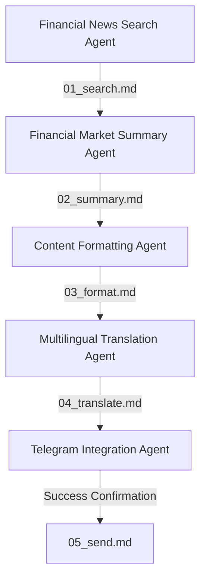

# 🚀 Financial Market Summary & Telegram Dispatcher Crew

An intelligent, multi-agent CrewAI pipeline designed to fetch, summarize, format, translate, and deliver recent market news directly to a Telegram channel. The system automatically downloads financial charts, embeds them, translates them into bilingual summaries (**Hindi** and **Hebrew**), and dispatches clean text messages alongside the charts as actual photo files.

---

## 🏗️ Architecture & Agent Flow

The crew is built with modularity and resilience in mind, composed of 5 specialized agents that collaborate sequentially:



### 👥 The Crew Members
1. **Financial News Search Agent**: Uses the `SerperDevTool` to search and fetch the top 3 most important, market-moving news headlines from major US indices (S&P 500, Nasdaq).
2. **Financial Market Summary Agent**: Distills news into a clean market summary (≤ 500 words), highlighting key performance indicators and index volatility.
3. **Content Formatting Agent with Image Integration**: Identifies topics requiring charts, runs the `download_financial_chart` tool to retrieve S&P 500 / Nasdaq index charts, and uses the `embed_image_in_markdown` tool to convert them to base64 embedded data within `03_format.md`.
4. **Multilingual Translation Agent**: Translates the formatted summary into target languages (defaulting to both **Hindi** and **Hebrew**) while preserving formatting, base64 images, and term accuracy.
5. **Telegram Integration Agent**: Runs the native `Send Telegram Message with Images` tool to parse base64 charts, clean up the text message, send text chunks, and upload decoded images as actual photo attachments.

---

## 🛠️ Built-in Custom Tools

All tools are natively integrated in the Python execution context:

*   **Download Financial Chart Image**: Natively contacts and downloads recent Yahoo Finance chart images for targeted indices (e.g., `^GSPC`, `^IXIC`).
*   **Embed Image in Markdown**: Converts downloaded PNGs to base64 URIs and constructs markdown embedding tags.
*   **Send Telegram Message with Images**: 
    *   Reads the final bilingual translation markdown file.
    *   Extracts base64-encoded image sources.
    *   Cleans raw HTML and base64 hashes from the text message.
    *   Splits long text into standard 4000-character chunks and posts them.
    *   Decodes and attaches the images as actual visual Telegram photo media (using `sendPhoto` for single uploads and `sendMediaGroup` for multiple charts).

---

## ⚙️ Setup & Configuration

### Prerequisites
- Python `>=3.10` and `<3.14`
- [UV Dependency Manager](https://docs.astral.sh/uv/)

### Installation

1. Install UV globally if not already present:
    ```bash
    pip install uv
    ```

2. Lock and install dependencies using the CrewAI CLI:
    ```bash
    crewai install
    ```

### Environment Variables
Create a `.env` file in the root directory:

```env
# Required for Search
SERPER_API_KEY=your_serper_api_key_here

# Telegram Channel Credentials
TELEGRAM_BOT_TOKEN=your_telegram_bot_token_here
TELEGRAM_CHAT_ID=your_telegram_chat_id_or_channel_username_here

# LLM Providers (Provide at least one)
GROQ_API_KEY=your_groq_api_key_here
OPENAI_API_KEY=your_openai_api_key_here
```

---

## 🎛️ Dynamic LLM Fallbacks & Cooldown Retries

The pipeline features advanced resiliency against common API errors:
- **Dynamic API Fallback**: If the Groq key hits daily token limit restrictions (TPD) or if OpenAI is selected, the crew automatically configures `primary_llm` and `secondary_llm` to use OpenAI `gpt-4o-mini` if the `OPENAI_API_KEY` is present. If not, it defaults to Groq models.
- **Enhanced Cooldown Retries**: The kickoff execution includes an incremental retry interval of `30 * (attempt + 1)` seconds (e.g. 30s, 60s, 90s, etc.). This ensures that temporary Groq Tokens Per Minute (TPM) limits have ample time to reset before retrying.

---

## 🚀 Running the Project

To execute the entire multi-agent system, run:

```bash
crewai run
```

This will run the crew, outputting the progress file by file in the project root:
- `01_search.md`: Raw search output.
- `02_summary.md`: Clean summary details.
- `03_format.md`: Formatted summary with base64 embedded charts.
- `04_translate.md`: Translated Hindi + Hebrew document.
- `05_send.md`: Final delivery status confirmation from the Telegram dispatcher.
